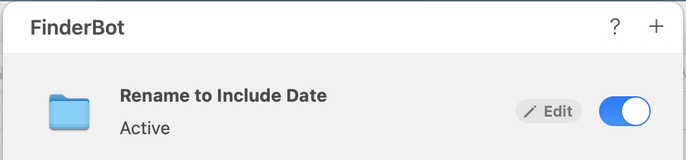

#  FileBot Help


## Welcome

Create dynamic automations for your folders. They will be activated whenever you add a new file. Easily build useful workflows to organize your folders, sort documents, cleanup old data, and more.

Your automations are always accessible from the Menu Bar. Activate one of the existing automations, such as sorting the Downloads folder by document type. Enable, disable, and customize your automations – all from the Menu Bar.

Easily create your own automations right from the Menu Bar. Build your workflows in an intuitive visual manner, or use more advanced features, such as variables and modifiers. You can always learn more about the features available by clicking the help button.

## Creating an Automation

## Managing Automations

You can manage your existing automations in several ways, giving you even more flexibility with how you can use them.

### Activate / Deactivate

Instead of deleting an automation that you might need in the future, you can deactivate it. You will see a switch on the right of your automation when listing them. If the switch appears on, the automation is running. It will keep running as long as you see the app icon in the Menu Bar.



To disable an automation, simply flip the switch. The changes are saved automatically.

### Edit

To edit an automation, either click the **Edit** button by hovering over an item of interest, or right click on an automation you'd like to edit and select **Edit** from the context menu.

Keep in mind that once you save changes, they will immediately apply to the automation if it's currently active. Changes cannot be reverted.

### Delete

All automations are deleted permanently, so be careful. For most cases, you might consider **disabling** an automation instead.

To permanently delete an automation, right click on the automation you'd like to delete and select **Delete** from the context menu.

## Scripting (Advanced)

When creating actions, it is sometimes useful to know some information about the file, such as its current name, or the state of the automation, such as which conditions were satisfied, or even the global system state, such as the current date.

FileBot supports all those (more advanced) use cases. 

### Supported Actions

Actions that support scripting:
- Rename
- Move to folder named
- Move to folder (custom)

### Getting Started

FileBot contains a convenient autocomplete engine to help you with scripting. Simply type **$** into a supported text field (see support above), and see all the supported actions for the given context.

Anything you include within the brackets `${}` will be interpreted as a **computed value**. There are 2 types of values you can use: pre-defined and dynamic computed values.

These computed values will be replaced with the actual values, such as the name of the file for `${name}`, when your automation executes. These values may change based on the given file and context.

#### Autocompletion

To get familiar with the computed values available to you, use autocompletion. If you just type **$** into a supported text field, you should see all computed values you can use. Double click on an item or press return while it's selected to automatically fill it in – no need to remember the syntax!

#### Pre-defined computed values

These are the computed values that do not depend on what conditions you have in the rule. They can be the name of the file being processed (`${name}`), or the name of the current month (`${monthName}`). 

Here are some examples:
- `Hello ${monthName}` will be replaced with `Hello October` (depending on the current month, of course).
- `Today is ${date}` will be replaced with `Today is 24 October 2021`.

#### Dynamic computed values

These are the values that simply include a number between the brackets. This number refers to the result of a condition at a specific number in the rule (first condition is denoted by 1, second with 2, etc.). This lets you use the result of the execution of that condition within your action.

For example, let's say you have a condition for "file type is," and the value you put into the text field is "pdf, jpg." In other words, the rule will execute if the file type is either pdf or jpg. Let's select "move to folder named" as the action type and enter `${1}` in the text field. Don't forget to also select the base folder.

In this example, all pdf and jpg files will be moved to folders named "pdf" or "jpg" within the base folder you specify. Pretty convenient for sorting files into folders by type!

If you had more than one condition, you could refer to them with `${2}`, `${3}`, etc.

### Modifiers

There are several modifiers available to help you build more advanced workflows. You can include a modifier by inserting a period (**.**) without any whitespace after the computed value. Modifiers can only be applied to computer values, and will not be interpreted otherwise.

For example, these are valid modifiers:
```
${1}.upper
${name}.lower
```
But these aren't:
```
$upper
hello.upper
.upper
```

Note: chaining modifiers is currently not supported. Any chained modifiers will be interpreted as regular text.
